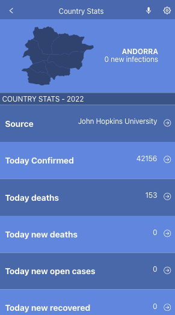

# Metrics WebApp

> In this project I built a mobile web application to check a list of countries COVID status making use of React and Redux.


## Screenshot



## Built With

- React
- Redux
- SCSS
- JavaScript
- HTML

## Live Demo

For a live demo
- Netlify [click here](https://alexr16-makes-great-sites.netlify.app/).

## Getting Started

To get a local copy of the project, follow these steps: 
1. Open the terminal and navigate to the folder where you would like to put these files.
2. Type the following commands into the terminal: 
 ```
 git clone https://github.com/Alexr16/Metrics-webapp
 ```
 ```
 cd MathMagicians
 ```
 
## Run project

```bash
$ npm install
$ npm run start # this will make webpack watching for your changes in code
```

### Open page in browser

```bash
$ open dist/index.html
```

## Author

👤 **George**

- GitHub: [@Alexr16](https://github.com/Alexr16)
- Twitter: [@ReveloJ](https://twitter.com/ReveloJ)
- LinkedIn: [Jorge Ríos](https://www.linkedin.com/in/jorgeriosr/)

## 🤝 Contributing

Contributions, issues, and feature requests are welcome!

Feel free to check the [issues page](https://github.com/Alexr16/Metrics-webapp/issues).

## Show your support

Give a ⭐️ if you like this project!

## Acknowledgments

- Thanks to my peers who are always there to offer support. 
- Original design idea by Nelson Sakwa on Behance.

## 📝 License

This project is [MIT](./LICENSE) licensed.

